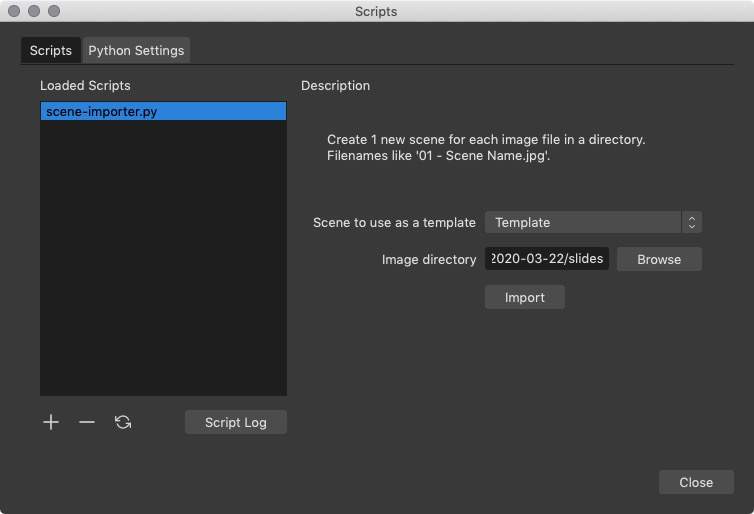
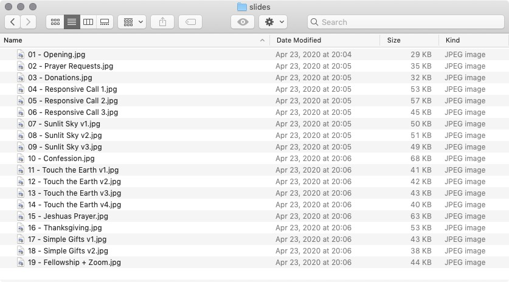
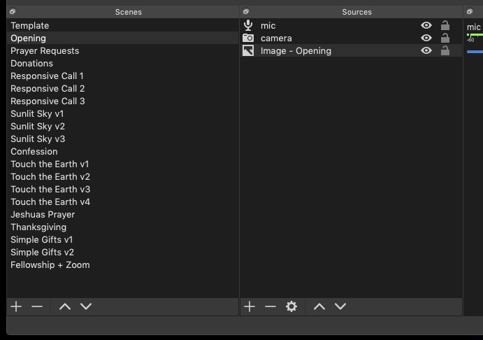

# OBS Scene Importer

  * Import a directory of image files into OBS, creating a new source and scene
    for each image.
  * Each new scene is based on an existing scene, which can be used as a
    template.



## Use Case

For our church live-stream productions, we have many image slides to set up
each week. Each one uses the same audio input and overlays the same camera shot
in the corner of each slide.

I set up the images to be imported in a directory, and create a template scene
that includes the audio and camera sources. Then I run this script to create
all the new scenes.

## Example

A directory of images like this:



Will look like this in OBS after the script finishes:



## Directory Structure

The script imports images in lexographical order, and expects the file names
to be in a format like `01 - Scene Name.jpg`.

Examples:

  * `01 - Scene A.jpg`: The `01` is discarded. Used only to order the files.
    This image would create a source called `Image - Scene A` and place it in
    a new scene named `Scene A`.
  * `02 - Art Project.jpg`: This image would create a source called `Image - Art Project`
    and place it in a new scene named `Art Project`.

## Limitations

  * Script was developed on OSX. I haven't tested it on Windows. (If you do use
    this script on Windows, please let me know.)
  * Images are not resized or fit to the canvas. They will likely need to be
    resized/tweaked manually after import.
  * Every file in your selected directory should be an image. The script doesn't
    attempt to filter out non-image files, and I haven't tested how OBS responds
    to non-image files which are run through this process.

## Python Setup

Leaving these notes here because the OBS documentation was unclear.

  * As of April 2020, `brew install python` installs python 3.7.7. This is fine
    for OBS 25 on Mac. I saw many references saying OBS required python <= 3.6, but this
    is no longer the case on Mac. (OBS on Windows still requires python 3.6.)
  * In OBS, go to the Tools -> Scripts menu and select the 'Python Settings' tab.
  * The Python Install Path should be `/usr/local/Cellar/python/3.7.7/Frameworks/Python.framework/Versions/3.7`
    Make sure that directory actually exists. You might need to tweak the path to
    match the python version you've installed.

If it helps to see how mine looks, here's what I have:

```
$ ls -lh /usr/local/Cellar/python/3.7.7/Frameworks/Python.framework/Versions/3.7
total 4616
lrwxr-xr-x   1 alex  staff    18B Apr 19 15:49 Headers -> include/python3.7m
-rwxr-xr-x   1 alex  staff   2.3M Apr 19 15:50 Python
drwxr-xr-x   4 alex  staff   128B Apr 19 15:50 Resources
drwxr-xr-x  16 alex  staff   512B Apr 19 15:50 bin
drwxr-xr-x   3 alex  staff    96B Apr 19 15:49 include
drwxr-xr-x   6 alex  staff   192B Apr 19 15:49 lib
drwxr-xr-x   3 alex  staff    96B Apr 19 15:50 share
```

## OBS + Python Development Notes

The scene configuration data in `~/Library/Application Support/obs-studio/basic/scenes`
(on OSX) is handy for seeing how data is supposed to be structured. Several of
the API calls used in this script were reverse-engineered by reading that data.
